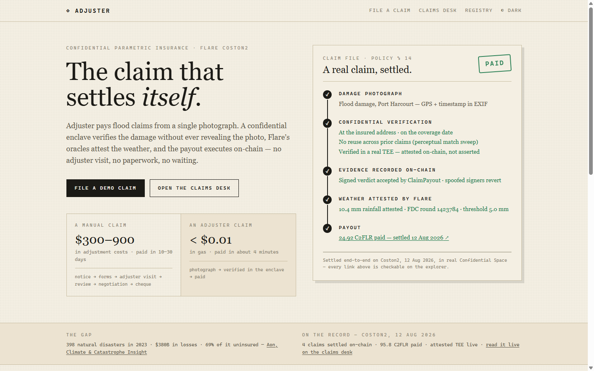
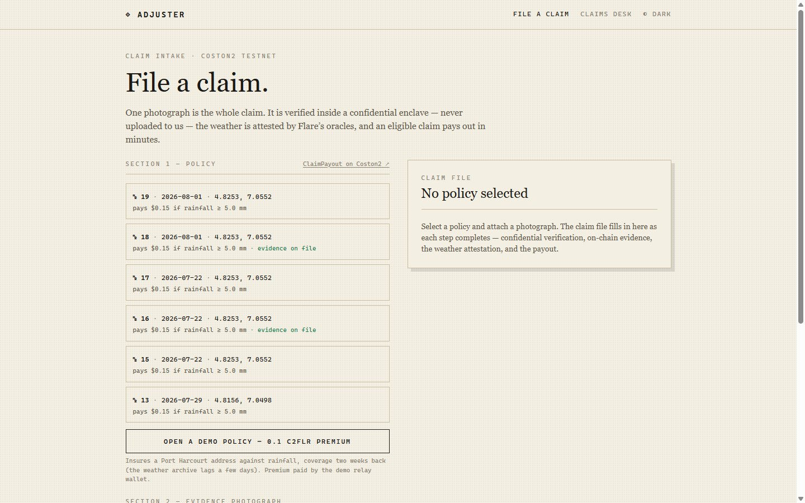
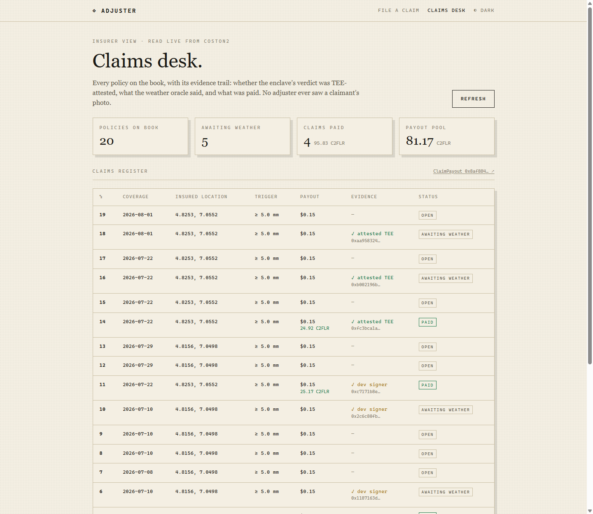

# Adjuster

**The confidential evidence layer for parametric insurance.** A claimant photographs storm damage. The photo is verified *inside a hardware enclave* — never seen by the insurer, never stored anywhere — and the enclave's signed verdict settles a policy on Flare: rainfall attested by the Flare Data Connector, payout converted at the FTSOv2 price, money moved in about four minutes.

[](LICENSE)
[](#getting-started)
[](https://coston2-explorer.flare.network/address/0x8af8843C9F2474F0528970161bc4C1db62e3B8b9)
[](https://tee.agentarc.online/health)

> A manual damage claim costs the insurer **$300–900** and takes the claimant **10–30 days**. Adjuster settled one on-chain for **under $0.01 in gas, in ~4 minutes** — without any human ever seeing the photograph.

**Live demo:** [adjuster.agentarc.online](https://adjuster.agentarc.online) · **Live enclave:** [tee.agentarc.online/health](https://tee.agentarc.online/health) · **Work ledger:** [docs/work-ledger.md](docs/work-ledger.md)

Built for the **Flare Summer Signal** hackathon — *Confidential Compute Apps* bounty.



---

## Contents

- [Why this exists](#why-this-exists)
- [How it works](#how-it-works)
- [What the enclave checks](#what-the-enclave-checks)
- [How Flare carries the weight](#how-flare-carries-the-weight)
- [Live on Coston2](#live-on-coston2)
- [C2PA soft-binding resolver](#c2pa-soft-binding-resolver)
- [Getting started](#getting-started)
- [Security hardening](#security-hardening)
- [Honest limitations](#honest-limitations)
- [Project provenance](#project-provenance)
- [Roadmap](#roadmap)
- [License](#license)

## Why this exists

Parametric insurance pays on a trigger — "it rained 50mm at your address, here's your money" — so it skips the loss adjuster entirely. That is also its weakness: a pure weather trigger cannot tell whether *you* actually suffered damage, and it has no defence against the same photograph being recycled across five policies.

Adding evidence normally means surrendering privacy. Photographs of a flooded home are photographs of the inside of someone's home. Handing them to an insurer's claims system, and to whoever that system is breached by, is the price of being paid.

Adjuster removes that trade. Evidence is examined in a Trusted Execution Environment, and only a *verdict* — signed by a key that exists nowhere but inside the enclave, and provably so on-chain — ever leaves it.

## How it works

```
Browser ──photo──▶ ENCLAVE (Confidential Space)          ← the photo goes here and stops here
                     │  EXIF · SHA-256 · dHash
                     │  reads policy terms from the contract
                     ├──hash only──▶ registry  (/api/lookup, /api/claims)
                     │
                     └──signed FCC ActionResult──▶ browser
                                                     │
                              ClaimPayout.submitEvidence  ← ecrecover + vTPM quote check
                                                     │
                              ClaimPayout.settle ──▶ FDC Web2Json proof (rainfall)
                                                     └▶ FTSOv2 FLR/USD ──▶ payout
```

Surfaces: [`/`](https://adjuster.agentarc.online) the pitch and a real settled claim · [`/claim`](https://adjuster.agentarc.online/claim) the claimant flow · [`/desk`](https://adjuster.agentarc.online/desk) the insurer's live view of the chain · [`/registry`](https://adjuster.agentarc.online/registry) the original media-provenance registry this was built on.



## What the enclave checks

The claimant's browser uploads the photograph **directly to the enclave**. It never touches this application's servers.

| Check | Method | Catches |
|---|---|---|
| **Location** | EXIF GPS, haversine distance against the policy's coordinates *read from the contract* | a photo taken somewhere else |
| **Date** | EXIF `DateTimeOriginal` against the policy's coverage window | a photo from before the storm |
| **Reuse** | perceptual hash (dHash) against every prior claim fingerprint — the search skips past the claimant's own records, so a same-policy retry can never mask a match on another policy | one photograph claimed on several policies |
| **Detail** | degenerate-fingerprint rejection | a blank frame submitted to evade the reuse check |

The registry stores **hashes only** — it is queried by fingerprint, never by image. What comes back out of the enclave is an [FCC `ActionResult`](https://dev.flare.network/fcc/): the verdict, ABI-encoded and signed EIP-191, which `ClaimPayout.submitEvidence` reconstructs and `ecrecover`s.

## How Flare carries the weight

Four Flare protocols, each load-bearing — remove any one and the product stops working.

| Protocol | Role |
|---|---|
| **vTPM attestation** (`flare-vtpm-attestation`) | The contract verifies a Google Confidential Space token on-chain (RS256, real issuer keys registered) and will only accept evidence signed by a key with a live attested quote. An unattested signer reverts with `NotAttestedTee`. |
| **FDC — Web2Json** | Rainfall at the policy's coordinates and date, attested from Open-Meteo through the Data Connector with a Merkle proof. The contract pins the request URL *and* the canonical query parameters, so the attested figure cannot be redirected to a different place or day. |
| **FTSOv2** | Converts the policy's USD payout into FLR at the live feed price at settlement. |
| **FCC wire format** | The enclave signs settlements in Flare Confidential Compute's own `ActionResult` format, so the same enclave can register as a real FCC extension without changing the contract. |

**This closes a real gap in Flare's own example.** Flare's `fcc-weather-insurance` sample trusts an owner-set `teeAddress` — the contract believes whichever address the owner nominated. Adjuster instead requires the TEE to *prove itself* to the chain: the enclave generates its signing key inside the enclave (the Confidential Space launch policy forbids injecting one), submits its attestation token to `FlareVtpmAttestation.verifyAndAttest`, and re-attests before the quote expires each hour. The key earns its authority by attestation rather than by an owner vouching for it.

## Live on Coston2

| Contract | Address |
|---|---|
| `ClaimPayout` | [`0x8af8843C9F2474F0528970161bc4C1db62e3B8b9`](https://coston2-explorer.flare.network/address/0x8af8843C9F2474F0528970161bc4C1db62e3B8b9) |
| `FlareVtpmAttestation` | [`0xdf7fb88FcE2a9457a1a174845d702bF91aC8E19A`](https://coston2-explorer.flare.network/address/0xdf7fb88FcE2a9457a1a174845d702bF91aC8E19A) |
| `OidcSignatureVerification` | [`0xf9b394C4583eD23A1b97f93428ea9A3e70Ad5A74`](https://coston2-explorer.flare.network/address/0xf9b394C4583eD23A1b97f93428ea9A3e70Ad5A74) |

**The enclave runs in real Google Confidential Space** — a c3-standard-4 Intel TDX VM at [`tee.agentarc.online`](https://tee.agentarc.online/health), TLS terminated *inside* the enclave by a Let's Encrypt certificate whose key never exists outside TEE memory. Its in-enclave signing key registered its own vTPM quote on-chain ([`verifyAndAttest`](https://coston2-explorer.flare.network/tx/0xdc81f580643a4e63f59ccceab0200e2dd0c92d8f255e683b9e181bcae6c8aa49)) — the on-chain quote's image digest matches the running container image, and the quote renews itself hourly.

Four claims have run the full lifecycle and paid out on-chain — the latest entirely through the attested enclave:

- **Policy #14** — the first **fully-attested** claim: photo verified inside real Confidential Space (`attested=true`), evidence signed by the attested in-enclave key, FDC round 1423784 attested 10.4mm → [24.92 C2FLR paid, `evidenceAttested=true`](https://coston2-explorer.flare.network/tx/0x6b6f0a6403f1e57642bf744105ea24c43d624ecef0a8732c3b10cb19058557a6)
- **Policy #3** — evidence accepted → FDC round 1401182 attested 11.7mm → [23.29 C2FLR paid](https://coston2-explorer.flare.network/tx/0x6883b850c70ca8637cf71ed208c388735d07fe48216129b6e0878cc78db9e914)
- **Policy #5** — re-verified end-to-end through the serverless API routes → FDC round 1403092 → [22.45 C2FLR paid](https://coston2-explorer.flare.network/tx/0xbb40b3b67f3fb4b03989798d1786c9b4df0818118c5769cca3b7e8c4901762ce)
- **Policy #11** — 6 August 2026, photo to payout in one run → FDC round 1417483 attested 10.4mm at 4.8253, 7.0552 on 22 July → [25.17 C2FLR paid](https://coston2-explorer.flare.network/tx/0xdeb5e8e83353605a0d4b899c882aa9d8c5571b3c0e0996c151d48b7c3d05b7ee)

And spoofing is rejected, not merely discouraged: submitting a tampered payload, or signing with a wallet that has no attested quote, both revert with `NotAttestedTee` on-chain.



## C2PA soft-binding resolver

C2PA ([ISO/IEC 22144](https://c2pa.org/)) separates *hard bindings* (exact hashes) from *soft bindings* (fingerprints that survive re-encoding) — exactly the two mechanisms this registry has used all along — and specifies a [Soft Binding Resolution API](https://spec.c2pa.org/specifications/specifications/2.2/softbinding/Decoupled.html) for resolving a fingerprint to the content it identifies. Every such resolver today is a centralized service; this registry now answers the spec's query shape backed by TEE-verified evidence:

```
GET /api/c2pa/services/supportedAlgorithms          → {"fingerprints":[{"alg":"org.proofofreal.dhash"}]}
GET /api/c2pa/matches/byBinding?alg=…&value=<b64>   → {"matches":[{"manifestId":…,"similarityScore":0-100}]}
```

`byBinding` requires the same bearer key as `/api/lookup` (an open resolver would be a membership oracle), accepts the spec's GET and POST variants, and refuses degenerate fingerprints rather than matching noise. Honest scope: the algorithm identifier is self-assigned (dHash is not yet on C2PA's authoritative list) and matches resolve to registry record ids, not C2PA manifest stores — wrapping records in real manifests is the roadmap step.

## Getting started

```bash
npm install
npm test                 # 119 unit tests
npm run dev              # the app

cd enclave && npm install && node server.mjs    # the verifier, dev mode (attested=false)
```

Health check before any demo — wallets drain, quotes expire hourly, and Google rotates its signing keys:

```bash
node scripts/health-check.mjs
node scripts/register-oidc-keys.mjs --check
```

Deploying the real enclave (fresh GCP project → attested TDX VM, one command, ten idempotent stages) is documented in [docs/enclave.md](docs/enclave.md); `node scripts/deploy-enclave.mjs --list` shows the pipeline.

## Security hardening

Shipped during the program, each found by auditing our own limitations:

- **Parser isolation** — image decoding (the classic RCE surface) runs in a disposable child process holding no secrets, so a decoder exploit lands in a process that cannot sign.
- **Retry-masking fix** — a claimant's own earlier upload can no longer hide a cross-policy match (the registry searches past the claimant's records; regression-tested).
- **Keyed lookups** — the hash-lookup endpoint requires a key, closing public membership tests.
- **Per-IP rate limiting** on the evidence endpoints.
- **Pre-upload attestation gate** — the claim page verifies the enclave's live on-chain vTPM quote and container digest *before* enabling upload; a swapped-in non-TEE server fails the check with no photo sent.

## Honest limitations

Stated because a demo that overclaims is worth less than one that doesn't. Each limit names its production path.

**Evidence layer.** EXIF can be forged with free tools — the chamber proves the photograph was *checked* honestly, not *taken* honestly; the production path is hardware-signed capture (C2PA / ISO&nbsp;22144, the spine of the roadmap). dHash is defeated by cropping and rotation (it catches re-encoding, resizing, and light edits; blank-frame evasion is explicitly rejected as uncomparable). EXIF timestamps carry timezone ambiguity of up to a day at coverage-window edges.

**Economics.** Policies can be bought for dates in the past — deliberate here because Open-Meteo's archive lags ~5 days, and unacceptable in production, where rainfall history is public and backdating must be forbidden (a one-`require` change) and premiums risk-priced (no underwriting exists). Basis risk is inherent to parametrics: the trigger is rainfall at coordinates, not damage — and the rainfall is interpolated reanalysis, not a gauge at the address. Concurrent settlements can race the pool; the loser reverts, so funds are safe but the UX isn't. FTSOv2 conversion at settlement time exposes payout size to price movement on a thin testnet feed.

**Privacy.** Policy coordinates are public on-chain — the photograph is protected, the insured location is not. The FDC request pin *requires* plaintext coordinates today; the production path is coordinate commitments with in-enclave request construction (Flare's own FCC example encrypts policy terms). The claim page now verifies the enclave's live on-chain vTPM quote and container digest *before* enabling upload — an operator swapping in a non-TEE server fails that check with no photo sent — but the TLS key itself is not quote-bound; full RA-TLS channel binding is roadmap. Fingerprints are not zero-knowledge: hash lookups now require a key (`REGISTRY_LOOKUP_KEY`), which closes public membership testing but not testing by key holders.

**Trust chain.** Cross-claim fraud detection trusts the registry to answer hash lookups honestly — a dishonest registry operator could hide matches; the registry's hash-chained ledger and the anchor contract exist precisely to make that tamper-evident, and anchoring every claim-fingerprint write is the production path. The root of "no one can enter" is Intel TDX plus Google's Confidential Space attestation — a strong, *chosen* root, not trustlessness; Google rotating its signing keys is a live dependency (it did so mid-program; the daily check caught and re-registered them). One enclave, no multi-node agreement. The contract still accepts a flagged dev signer so `/desk` can show amber-versus-green provenance; removing it is deleting one mapping.

**Operations.** Attestation quotes expire hourly and cost ~30 C2FLR/day to renew — if the in-enclave wallet runs dry the quote lapses and evidence reverts until refunded (fail-closed, visible on `/desk`). Every boot generates a fresh in-enclave key that must earn attestation again. Testnet only; the demo relays transactions from a server wallet so judges need no wallet — custody shortcut, not design. No KYC or sanctions screening, which real insurance money requires. The contracts are covered by live end-to-end scripts against Coston2, not unit tests.

## Project provenance

This project began as **Proof of Real**, a media-provenance registry built for a previous hackathon. That origin is stated plainly here because Summer Signal judges on evidence of new work during the program.

**Pre-existing (before 14 July 2026):** the Next.js registry, SHA-256 + dHash fingerprinting, the Ed25519-sealed hash-chained ledger, and LSH near-match. That prior work lives on at `/registry`.

**Built during the program:** everything Flare, everything confidential, and the entire insurance product — the anchor contract, `ClaimPayout.sol`, the vTPM attestation gating, the FDC Web2Json settlement path, FTSOv2 conversion, the enclave, the claim-intake forensics, the cross-claim fraud detection, the Supabase backend, the C2PA resolver, and all three Adjuster surfaces.

[`docs/work-ledger.md`](docs/work-ledger.md) is the dated, commit-linked record of every substantial change.

## Roadmap

Registration as a genuine FCC extension on Coston2 · full C2PA manifest repository semantics behind the soft-binding resolver (real manifest stores, registered algorithm identifier) · FXRP payouts · multi-node verifier agreement.

## License

[MIT](LICENSE) © 2026 Nabeel Uthman
